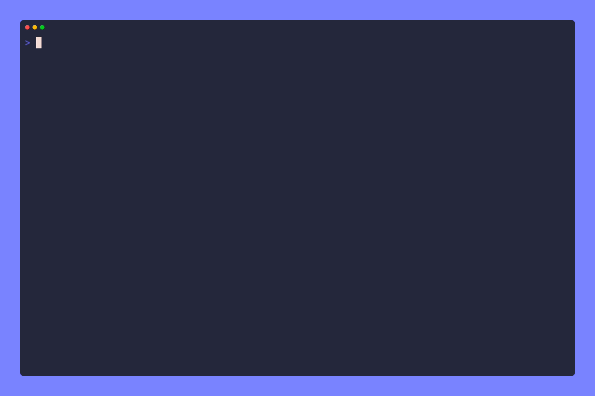
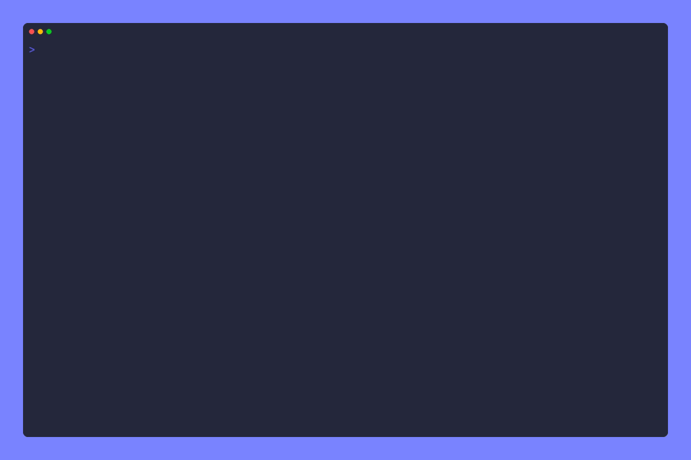

# Examples

This directory contains a bunch of example programs built with `cli` to show you how the library works and how you might implement common patterns.

- [Examples](#examples)
  - [`./cover`](#cover)
  - [`./quickstart`](#quickstart)
  - [`./subcommands`](#subcommands)
  - [`./namedargs`](#namedargs)
    - [TODO](#todo)

## `./cover`

Not really an example, but holds the source code used to generate the cover image with [freeze]

## `./quickstart`

Implements the [quickstart] command from the main project README

## `./subcommands`

A CLI with multiple subcommands, each with their own flags and expected arguments. Shows how to easily store parsed flag values in an options struct and pass them around your program.

## `./namedargs`

A CLI with named positional arguments that may or may not have default values. Shows how to retrieve these arguments by name and use them without having to care if they were provided or you're using the default.

### TODO

- Replicate one or two well known CLI tools as an example
  - Docker
  - Cargo

[quickstart]: <https://github.com/FollowTheProcess/cli#quickstart>
[freeze]: <https://github.com/charmbracelet/freeze>
